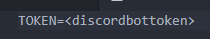
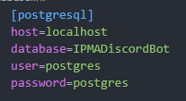

# IPMA Discord Bot

**A bot that consists in sending a city's weather info for a Discord chat channel.**

## Features

- Check the city list;
- Set the city you want to receive weather info from;
- Set the time of the day you want to receive that info (the bot sends a message everyday).

## Stack

- Python with discord.py, requests.py, json.py, psycopg2
- PostgresSQL
- **[IPMA API](https://api.ipma.pt/)**

## Setup

**In order to help to develop this bot and code or test it by yourself, you must:**

- Install all dependencies (python-dotenv, discord, psycopg2);
- Create a .env file with the token for your bot  

- Create a database.ini file inside database_stuff with PostgresSQL configuration data like shown below  

- Have the database created with the necessary tables
```
CREATE DATABASE IPMADiscordBot;

CREATE TABLE cities(
	city_code bigint NOT NULL,
	server_id bigint NOT NULL,
	CONSTRAINT cities_pk PRIMARY KEY (city_code, server_id)
);

CREATE TABLE schedule(
	 city_code bigint NOT NULL,
	 schedule time NOT NULL,
	 CONSTRAINT schedule_pk PRIMARY KEY (city_code)
);
```

### Useful links

- [Trello](https://trello.com/b/caa0Op4o/ipma-discord-bot)
- [My LinkedIn](https://www.linkedin.com/in/duarteribeiromelo/)
